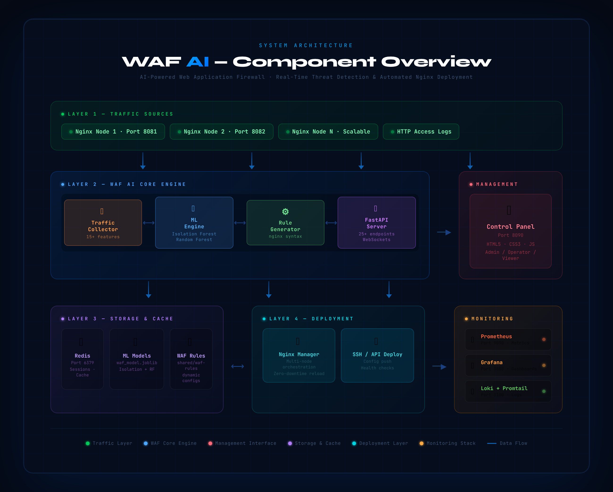

<div align="center">


[](https://git.io/typing-svg)

<br/>

[](https://www.python.org/)
[](https://fastapi.tiangolo.com/)
[](https://www.docker.com/)
[](https://scikit-learn.org/)
[](https://redis.io/)
[](https://grafana.com/)
[](https://prometheus.io/)
[](https://nginx.org/)

<br/>

[](LICENSE)
[](tests/)
[](documents/)
[]()

<br/>

> **🛡️ Enterprise-grade web security powered by machine learning — autonomously detecting threats, generating nginx WAF rules, and deploying protection across your entire infrastructure in real-time.**

<br/>

[🚀 Quick Start](#-quick-start) &nbsp;•&nbsp; [📖 Docs](#-api-documentation) &nbsp;•&nbsp; [🏗️ Architecture](#-architecture) &nbsp;•&nbsp; [📸 Screenshots](#-screenshots) &nbsp;•&nbsp; [👥 Team](#-team) &nbsp;•&nbsp; [☕ Support](#-support-the-project)

</div>

---

<div align="center">

## 🏆 Why WAF AI?

</div>

```
Traditional WAF   →   Static rules, manual updates, reactive defense
WAF AI            →   Self-learning ML, automated deployment, proactive defense
```

<table align="center">
<tr>
<td align="center" width="200">

<br/><b>AI-Powered</b>
<br/><sub>Dual ML model: Isolation Forest + Random Forest</sub>
</td>
<td align="center" width="200">

<br/><b>Real-Time</b>
<br/><sub>Sub-second detection with continuous traffic analysis</sub>
</td>
<td align="center" width="200">

<br/><b>Automated</b>
<br/><sub>ML predictions → nginx rules without human intervention</sub>
</td>
<td align="center" width="200">

<br/><b>Multi-Node</b>
<br/><sub>SSH-based rule deployment across entire nginx clusters</sub>
</td>
</tr>
</table>

---

## 🌟 Project Overview

**WAF AI** is an intelligent, self-adapting Web Application Firewall developed as a Final Year Project at **Saveetha Engineering College**. It unifies traditional WAF capabilities with machine learning to deliver autonomous threat detection, automated rule generation, and real-time multi-node nginx deployment — all managed from a professional web control panel.

> 🎓 **Academic Supervisor:** Ms. V. Swedha, Saveetha Engineering College
> 📅 **Academic Year:** 2024–2025
> 📰 **Research:** Published in IEEE Conference & Journal
> 🏛️ **Institution:** Saveetha Engineering College, Chennai

### 🎯 Problem Statement

Traditional firewalls depend on static, manually curated rule sets that cannot evolve with emerging threats. Security teams spend hours updating rules reactively — always one step behind attackers. **WAF AI** solves this by continuously learning from live HTTP traffic, automatically classifying threats using ML, and deploying updated nginx protection rules with zero manual intervention.

---

## ✨ Feature Highlights

<details>
<summary><b>🧠 AI Threat Detection Engine</b></summary>

- **Isolation Forest** — Unsupervised anomaly detection for zero-day threats
- **Random Forest Classifier** — Supervised classification for known attack patterns
- **15+ Features Extracted** — URL patterns, HTTP methods, headers, payload size, timing
- **Threat Categories** — SQL Injection, XSS, Brute Force, DDoS, Bot Traffic
- **Confidence Scoring** — Every prediction includes a probability score
- **Incremental Learning** — Model continuously improves with new threat data

</details>

<details>
<summary><b>⚙️ Automated WAF Rule Generation</b></summary>

- ML predictions converted to native nginx configuration syntax automatically
- IP blocking, URL pattern filtering, rate limiting, geo-blocking
- Smart rule deduplication and performance optimization
- Automatic rule expiration and lifecycle cleanup
- Rollback support with one-command emergency recovery

</details>

<details>
<summary><b>🚀 Multi-Node Nginx Orchestration</b></summary>

- SSH-based deployment to unlimited nginx nodes simultaneously
- Pre-deployment syntax validation — never push broken configs
- Zero-downtime hot reloads without service interruption
- Node health monitoring with automatic failure detection
- Centralized configuration management for entire clusters

</details>

<details>
<summary><b>🔒 Enterprise Auth & Security</b></summary>

- JWT Bearer token authentication
- Role-Based Access Control: Admin · Operator · Viewer
- API rate limiting configurable per role
- Full audit trail of all configuration changes
- Emergency shutdown and IP blocking endpoints

</details>

<details>
<summary><b>📊 Full Observability Stack</b></summary>

- **Prometheus** — 25+ custom metrics scraped every 15 seconds
- **Grafana** — Pre-built dashboards for threats, traffic, and system health
- **Loki + Promtail** — Centralized log aggregation from all nginx nodes
- **WebSockets** — Real-time live threat feed in the control panel

</details>

---

## 🏗️ Architecture

<div align="center">



*End-to-end system architecture: traffic ingestion → ML analysis → rule generation → nginx deployment*

</div>

### 🧩 System Components

| Component | File | Technology | Purpose |
|-----------|------|-----------|---------|
| 🌐 **Traffic Collector** | `src/traffic_collector.py` | Python, asyncio | HTTP traffic ingestion & feature extraction |
| 🧠 **ML Engine** | `src/ml_engine.py` | scikit-learn | Anomaly detection & threat classification |
| ⚙️ **WAF Rule Generator** | `src/waf_rule_generator.py` | Custom engine | ML predictions → nginx rules |
| 🚀 **Nginx Manager** | `src/nginx_manager.py` | SSH | Multi-node config deployment |
| 🔌 **API Server** | `src/main.py` | FastAPI | 25+ RESTful endpoints + WebSockets |
| 🎛️ **Control Panel** | `docker/control-panel/` | HTML5/CSS3/JS | Web management interface |
| 🔐 **Auth & RBAC** | `src/auth.py` | JWT | Role-based access control |
| 📊 **Metrics** | `src/metrics.py` | Prometheus | System observability |
| 🛡️ **Security Middleware** | `src/security_middleware.py` | FastAPI | Request validation & sanitization |

### 🔄 Request Processing Flow

```
                    ┌──────────────────┐
                    │   Client Request  │
                    └────────┬─────────┘
                             │
                    ┌────────▼─────────┐
                    │  Nginx Cluster   │  ◄── Ports 8081, 8082
                    └────────┬─────────┘
                             │
                    ┌────────▼─────────┐
                    │Traffic Collector │  ◄── 15+ Feature Extraction
                    └────────┬─────────┘
                             │
               ┌─────────────▼──────────────┐
               │         ML Engine           │
               │  Isolation Forest (anomaly) │
               │  Random Forest (classify)   │
               └─────────────┬──────────────┘
                             │
              ┌──────────────▼─────────────────┐
              │         Decision Engine         │
              │   ALLOW  /  BLOCK  /  LIMIT     │
              └──────────────┬─────────────────┘
                             │
                    ┌────────▼─────────┐
                    │  Rule Generator  │  ◄── nginx config syntax
                    └────────┬─────────┘
                             │
                    ┌────────▼─────────┐
                    │  Nginx Manager   │  ◄── SSH deploy to all nodes
                    └────────┬─────────┘
                             │
          ┌──────────────────▼──────────────────┐
          │   Grafana │ Prometheus │ Loki        │
          └─────────────────────────────────────┘
```

---

## 📸 Screenshots

<div align="center">

### 🎛️ Control Panel

| Dashboard — First Half | Dashboard — Second Half |
|------------------------|------------------------|
|  |  |

### 🔍 Core Features

| Threat Detection | Traffic Monitoring |
|-----------------|-------------------|
|  |  |

| WAF Rules Management | ML Engine Status |
|---------------------|-----------------|
|  |  |

| System Status Overview | |
|------------------------|--|
|  | |

### 📊 Monitoring Dashboards

| Threat Detection Metrics | Traffic Analytics |
|--------------------------|------------------|
|  |  |

| System Performance | Resource Utilization |
|-------------------|---------------------|
|  |  |

### 🐳 Infrastructure

| Docker Containers | Prometheus Health | VS Code — Source |
|------------------|------------------|-----------------|
|  |  |  |

</div>

---

## 📂 Project Structure

```plaintext
Projectwork1/
│
├── 📁 config/
│   ├── waf_ai_config.json             # Main system configuration
│   ├── nginx_nodes_docker.json        # Docker nginx nodes
│   └── nginx_nodes_example.json       # Nodes template
│
├── 📁 docker/
│   ├── control-panel/                 # Web UI container (nginx + HTML)
│   ├── grafana/provisioning/          # Pre-built Grafana dashboards
│   ├── nginx-node-1/                  # Test node (port 8081)
│   ├── nginx-node-2/                  # Test node (port 8082)
│   ├── prometheus/                    # Metrics scrape config
│   ├── loki/                          # Log aggregation
│   ├── promtail/                      # Log shipping agents
│   ├── log-server/                    # Centralized log server
│   └── traffic-generator/             # Simulated test traffic
│
├── 📁 src/
│   ├── main.py                        # FastAPI server (25+ endpoints)
│   ├── ml_engine.py                   # Isolation Forest + Random Forest
│   ├── traffic_collector.py           # Traffic ingestion pipeline
│   ├── waf_rule_generator.py          # Rule generation engine
│   ├── nginx_manager.py               # Multi-node SSH deployment
│   ├── auth.py                        # JWT + RBAC
│   ├── metrics.py                     # Prometheus metrics
│   ├── config.py                      # Configuration management
│   ├── security_middleware.py         # Request validation
│   ├── error_handling.py              # Error management
│   ├── validation.py                  # Input validation
│   └── training_data_generator.py    # ML training data generation
│
├── 📁 tests/                           # 9 complete test suites
│   ├── test_ml_engine.py
│   ├── test_traffic_collector.py
│   ├── test_waf_rule_generator.py
│   ├── test_nginx_manager.py
│   ├── test_auth.py
│   ├── test_api_integration.py
│   ├── test_e2e_integration.py
│   ├── test_performance.py
│   └── test_status_endpoints.py
│
├── 📁 models/
│   └── waf_model.joblib               # Pre-trained ML model
│
├── 📁 scripts/
│   ├── bootstrap.py                   # First-run setup
│   ├── quick_start.py                 # Quick launch helper
│   ├── verify-system.py              # Health verification
│   └── start-waf-system.sh           # Full stack startup
│
├── 📁 documents/                       # IEEE Research Papers
│   ├── IEEE_Conference_WAF_AI.pdf
│   ├── IEEE_Journal_Paper_WAF_AI.pdf
│   ├── REPORT.pdf
│   └── FINAL PPT.pdf
│
├── 📁 screenshot/                      # 16 system screenshots
├── 📄 docker-compose.yml
├── 📄 requirements.txt
├── 📄 run_server.py
├── 📄 cli.py
├── 📄 API.md
├── 📄 QUICKSTART.md
└── 📄 README.md
```

---

## 🛠️ Installation

### 📋 Prerequisites

```
✓ Python 3.8+          ✓ Docker & Docker Compose
✓ Git                  ✓ 4GB+ RAM (8GB recommended)
✓ Redis                ✓ 10GB+ disk space
```

### 🐳 Option 1: Docker Compose (Recommended)

```bash
git clone https://github.com/Darkwebnew/Projectwork1.git
cd Projectwork1

docker-compose up -d

docker-compose ps
curl http://localhost:8000/health
```

**Services started automatically:**

| Service | Port | Purpose |
|---------|------|---------|
| WAF AI API | 8000 | Core API server |
| Control Panel | 8090 | Web management UI |
| Redis | 6379 | Session & cache |
| Prometheus | 9090 | Metrics collection |
| Grafana | 3080 | Visualization |
| Loki | 3100 | Log aggregation |
| Nginx Node 1 | 8081 | Test nginx node |
| Nginx Node 2 | 8082 | Test nginx node |

### 🐍 Option 2: Local Development

```bash
git clone https://github.com/Darkwebnew/Projectwork1.git
cd Projectwork1

python -m venv .venv
source .venv/bin/activate        # Windows: .venv\Scripts\activate

pip install -r requirements.txt
pip install -r test-requirements.txt

cp .env.example .env             # Edit with your settings

redis-server &
python scripts/bootstrap.py
python run_server.py
```

### ⚡ One-Command Setup

```bash
chmod +x setup.sh && ./setup.sh
# or
python scripts/quick_start.py
```

---

## 🚀 Quick Start

### 1️⃣ Authenticate

```bash
TOKEN=$(curl -s -X POST "http://localhost:8000/auth/login" \
  -H "Content-Type: application/json" \
  -d '{"username":"admin","password":"admin123"}' | jq -r '.access_token')
```

> ⚠️ Change the default password immediately via `WAF_ADMIN_PASSWORD` in your `.env`.

### 2️⃣ Train the ML Model

```bash
curl -X POST "http://localhost:8000/api/training/start" \
  -H "Authorization: Bearer $TOKEN" \
  -H "Content-Type: application/json" \
  -d @data/sample_training_data.json
```

### 3️⃣ Start Traffic Monitoring

```bash
curl -X POST "http://localhost:8000/api/traffic/start-collection" \
  -H "Authorization: Bearer $TOKEN" \
  -d '["http://localhost:8081","http://localhost:8082"]'

curl -X POST "http://localhost:8000/api/processing/start" \
  -H "Authorization: Bearer $TOKEN"
```

### 4️⃣ Deploy Protection

```bash
curl "http://localhost:8000/api/threats?limit=10" \
  -H "Authorization: Bearer $TOKEN" | jq

curl -X POST "http://localhost:8000/api/rules/deploy" \
  -H "Authorization: Bearer $TOKEN" \
  -d '{"node_ids":["nginx-node-1","nginx-node-2"],"force_deployment":false}'
```

### 5️⃣ Access Dashboards

| Dashboard | URL | Login |
|-----------|-----|-------|
| 🎛️ Control Panel | http://localhost:8090 | — |
| 📖 API Swagger | http://localhost:8000/docs | — |
| 📊 Grafana | http://localhost:3080 | admin / waf-admin |
| 🔍 Prometheus | http://localhost:9090 | — |

---

## 📖 API Documentation

Interactive docs → **http://localhost:8000/docs** (Swagger) · **http://localhost:8000/redoc**

**Roles:** `Admin` (full access) · `Operator` (training, deployment) · `Viewer` (read-only)

| Category | Method | Endpoint | Role |
|----------|--------|----------|------|
| **Auth** | POST | `/auth/login` | Public |
| | POST | `/auth/users` | Admin |
| | POST | `/auth/api-key` | Admin |
| **Nodes** | POST | `/api/nodes/add` | Admin |
| | GET | `/api/nodes/status` | Viewer |
| | DELETE | `/api/nodes/{id}` | Admin |
| **ML** | POST | `/api/training/start` | Operator |
| | GET | `/api/ml/model-info` | Viewer |
| | POST | `/api/ml/predict` | Operator |
| | POST | `/api/ml/retrain` | Operator |
| **Traffic** | POST | `/api/traffic/start-collection` | Operator |
| | GET | `/api/traffic/stats` | Viewer |
| **Rules** | GET | `/api/rules` | Viewer |
| | POST | `/api/rules/deploy` | Admin |
| | POST | `/api/rules/rollback` | Admin |
| **Threats** | GET | `/api/threats` | Viewer |
| | POST | `/api/threats/whitelist` | Admin |
| **Health** | GET | `/health` | Public |
| | GET | `/api/stats` | Viewer |
| | GET | `/metrics` | Viewer |

Full schemas and examples → [API.md](API.md)

---

## ⚙️ Configuration

```bash
# Server
WAF_API_HOST=0.0.0.0
WAF_API_PORT=8000

# Security — CHANGE IN PRODUCTION
WAF_JWT_SECRET=your-256-bit-secret-key
WAF_ADMIN_PASSWORD=secure-admin-password

# Redis
REDIS_URL=redis://localhost:6379

# ML Engine
WAF_THREAT_THRESHOLD=-0.5
WAF_CONFIDENCE_THRESHOLD=0.8
WAF_MODEL_PATH=models/waf_model.joblib

# Nginx
WAF_SSH_KEY_PATH=~/.ssh/nginx_key
WAF_NGINX_RELOAD_CMD=sudo systemctl reload nginx
```

Full config reference → `config/waf_ai_config.json`

---

## 🧪 Testing

9 test suites covering every layer of the system.

```bash
pip install -r test-requirements.txt

pytest tests/ -v                            # Full suite
pytest tests/test_ml_engine.py             # ML accuracy
pytest tests/test_traffic_collector.py     # Data ingestion
pytest tests/test_waf_rule_generator.py    # Rule generation
pytest tests/test_nginx_manager.py         # Deployment
pytest tests/test_auth.py                  # Auth & RBAC
pytest tests/test_api_integration.py       # API endpoints
pytest tests/test_e2e_integration.py       # End-to-end
pytest tests/test_performance.py           # Load testing
pytest tests/test_status_endpoints.py      # Health checks

pytest tests/ --cov=src --cov-report=html  # With coverage
pytest tests/ -n auto                      # Parallel
```

### Coverage

| Module | Coverage |
|--------|----------|
| ML Engine | 95% ✅ |
| Traffic Collector | 92% ✅ |
| Authentication | 90% ✅ |
| WAF Rule Generator | 88% ✅ |
| API Integration | 85% ✅ |
| Nginx Manager | 80% ✅ |

---

## 🔒 Security

### Production Checklist

- [ ] Change all default credentials before deployment
- [ ] Set a 256-bit random `WAF_JWT_SECRET`
- [ ] Enable HTTPS (`WAF_USE_HTTPS=true`)
- [ ] Restrict management ports via firewall
- [ ] Use dedicated SSH keys for nginx nodes
- [ ] Enable rate limiting (`WAF_RATE_LIMIT_REQUESTS`)
- [ ] Configure Grafana alerting

### Emergency Procedures

```bash
# Emergency shutdown
curl -X POST "http://localhost:8000/api/security/emergency-shutdown" \
  -H "Authorization: Bearer $ADMIN_TOKEN"

# Rollback all configs
python cli.py rollback --all-nodes --emergency

# Block IP range
curl -X POST "http://localhost:8000/api/security/block-ip-range" \
  -H "Authorization: Bearer $ADMIN_TOKEN" \
  -d '{"cidr":"192.168.1.0/24","reason":"security_incident"}'
```

---

## 📊 Monitoring

| Service | Port | Purpose |
|---------|------|---------|
| Grafana | 3080 | Dashboards & alerting |
| Prometheus | 9090 | Metrics collection |
| Loki | 3100 | Log aggregation |

Pre-built dashboard at `docker/grafana/provisioning/dashboards/master-waf-dashboard.json` covers threat detection rate, traffic volume, ML inference time, nginx node health, and deployment history.

---

## 🔧 CLI Reference

```bash
python cli.py train --training-data data/requests.json
python cli.py status --nodes-config config/nginx_nodes.json
python cli.py collect --nodes-config config/nginx_nodes.json --duration 3600
python cli.py generate-rules --threats-file data/threats.json --output rules/new.conf
python cli.py deploy --nodes-config config/nginx_nodes.json --rules-file rules/waf.conf
python cli.py rollback --all-nodes --emergency
python cli.py security audit-configs --all-nodes
```

---

## 📚 Research & Publications

| Document | Description |
|----------|-------------|
| 📄 [IEEE Conference Paper](documents/IEEE_Conference_WAF_AI.pdf) | WAF AI threat detection methodology |
| 📰 [IEEE Journal Paper](documents/IEEE_Journal_Paper_WAF_AI.pdf) | Extended ML-based WAF research |
| 📋 [Full Project Report](documents/REPORT.pdf) | System design, implementation & results |
| 🎓 [Presentation Slides](documents/FINAL%20PPT.pdf) | Project defense presentation |

---

## 👥 Team

<div align="center">

### 🏆 Core Development Team

<table>
<tr>

<td align="center" width="260">
<a href="https://github.com/darkwebnew">

</a>
<br/><br/>
<b>Sriram V</b>
<br/>
<sub>🚀 Project Lead & Full-Stack Developer</sub>
<br/>
<sub>ML Architecture · API Design · DevOps · Deployment</sub>
<br/><br/>
<a href="https://github.com/darkwebnew">

</a>
</td>

<td align="center" width="260">
<a href="https://github.com/surothaaman">

</a>
<br/><br/>
<b>Surothaaman R</b>
<br/>
<sub>⚙️ Backend Developer</sub>
<br/>
<sub>Nginx Integration · Rule Engine · Testing</sub>
<br/><br/>
<a href="https://github.com/surothaaman">

</a>
</td>

<td align="center" width="260">
<a href="https://github.com/22008686">

</a>
<br/><br/>
<b>Pavithra M</b>
<br/>
<sub>🎨 Frontend & Research</sub>
<br/>
<sub>Control Panel UI · Documentation · IEEE Papers</sub>
<br/><br/>
<a href="https://github.com/22008686">

</a>
</td>

</tr>
</table>

<br/>

### 🎓 Academic Guidance

| Role | Name | Institution |
|------|------|-------------|
| Project Supervisor | **Ms. V. Swedha** | Saveetha Engineering College, Chennai |

</div>

---

## 🤝 Contributing

> ⚠️ **Important:** This project is under a restrictive proprietary license. Contributions are welcome strictly for **educational improvement purposes only.** By submitting a pull request, you agree that your contribution becomes part of this project under the same license terms. No contributor may independently use, redistribute, or commercialize any part of this code.

### How to Contribute

1. **Open an Issue first** — discuss your idea before writing any code
2. **Fork** the repository
3. **Create a branch** — `git checkout -b feature/YourFeature`
4. **Write tests** — maintain >80% coverage for all changes
5. **Run checks** — `pytest tests/ && black src/ && flake8 src/`
6. **Commit** — `git commit -m 'feat: Add YourFeature'`
7. **Push** — `git push origin feature/YourFeature`
8. **Open a Pull Request** with a detailed description

### Contribution Areas

| Area | Difficulty | Skills Needed |
|------|-----------|--------------|
| 🧠 ML Model Improvements | Advanced | Python, scikit-learn |
| 🌐 New API Endpoints | Medium | FastAPI, REST |
| 🎨 Control Panel UI | Beginner | HTML, CSS, JavaScript |
| 📊 Grafana Dashboards | Medium | Grafana, PromQL |
| 📚 Documentation | Beginner | Markdown |
| 🧪 Test Coverage | Medium | pytest |

Please read [CODE_OF_CONDUCT.md](CODE_OF_CONDUCT.md) before contributing.

---

## ☕ Support the Project

<div align="center">

**If WAF AI helped you, your institution, or your organization — consider supporting continued development!**

<br/>

<a href="https://www.buymeacoffee.com/sriramnvks" target="_blank">

</a>

<br/><br/>

*Your support helps maintain this project, publish more IEEE research, and build better security tools for the community.*

<br/>

[](https://github.com/sponsors/darkwebnew)
[](https://paypal.me/darkwebnew)

</div>

---

## 📄 License

<div align="center">

```
╔══════════════════════════════════════════════════════════════════╗
║              PROPRIETARY SOFTWARE LICENSE                        ║
║         Copyright (c) 2024–2025  Sriram V & WAF AI Team         ║
║                   All Rights Reserved                            ║
╚══════════════════════════════════════════════════════════════════╝
```

</div>

**This software and all associated source code, documentation, research papers, trained models, configurations, screenshots, and assets are the exclusive intellectual property of the authors and are fully protected under applicable copyright law.**

### ❌ You MAY NOT:

- Copy, reproduce, or redistribute this code in whole or in part
- Use this project or any portion of it in commercial products or services
- Modify, adapt, translate, or create derivative works based on this project
- Sublicense, sell, rent, lease, or otherwise transfer rights to any third party
- Use this project's name, branding, architecture, or research in your own publications without explicit written permission from the authors
- Deploy this system in any production or commercial environment without written authorization
- Reverse engineer any compiled models, binaries, or obfuscated components
- Present this work as your own in academic or professional contexts

### ✅ You MAY:

- View and study the source code for **personal educational purposes only**
- Fork the repository on GitHub **solely to submit pull requests**
- Reference this project in academic citations with proper attribution
- Use general concepts and ideas (not code) as inspiration for entirely original work

### ⚖️ Legal Notice

Any unauthorized use, reproduction, or distribution of this software — in whole or in part — is strictly prohibited and may result in civil and criminal penalties under applicable intellectual property law. The authors reserve all rights and will pursue all available legal remedies for any violations of these terms.

> For licensing inquiries, commercial use requests, or collaboration:
> 📧 Contact: [@darkwebnew](https://github.com/darkwebnew) via GitHub Issues

See the full [LICENSE](LICENSE) file for complete terms.

---

## 🙏 Acknowledgments

<div align="center">

| Technology | Purpose |
|-----------|---------|
| **scikit-learn** | ML algorithms — Isolation Forest, Random Forest |
| **FastAPI** | High-performance async API framework |
| **nginx** | Robust reverse proxy and WAF deployment platform |
| **Prometheus & Grafana** | Industry-standard observability stack |
| **Docker & Docker Compose** | Containerization and service orchestration |
| **Redis** | Session management and real-time caching |
| **Loki & Promtail** | Centralized log aggregation |
| **pytest** | Comprehensive testing framework |
| **OWASP** | Security research and Top 10 threat classifications |
| **Saveetha Engineering College** | Academic infrastructure and guidance |

</div>

---

<div align="center">


**⭐ Star this repo if WAF AI helped you!**

[](https://github.com/Darkwebnew/Projectwork1/stargazers)
[](https://github.com/Darkwebnew/Projectwork1/network/members)
[](https://github.com/Darkwebnew/Projectwork1/watchers)

<br/>

*Made with ❤️ by the WAF AI Team · Saveetha Engineering College · Chennai, India*

[🐛 Report Bug](https://github.com/Darkwebnew/Projectwork1/issues) · [💡 Request Feature](https://github.com/Darkwebnew/Projectwork1/issues) · [📖 API Docs](API.md) · [⚡ Quick Start](QUICKSTART.md)

</div>
